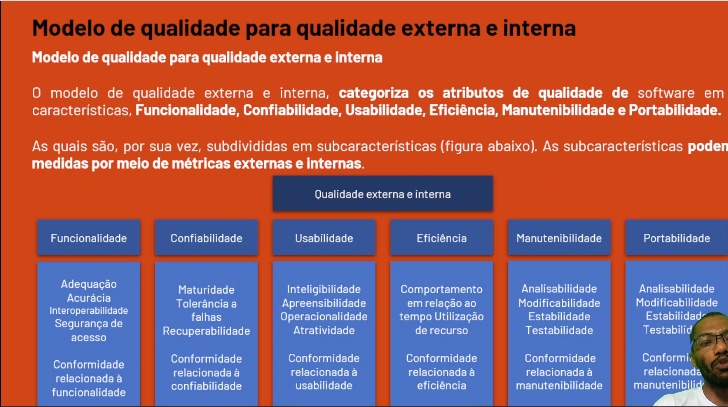
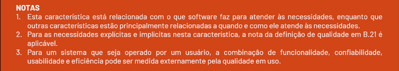
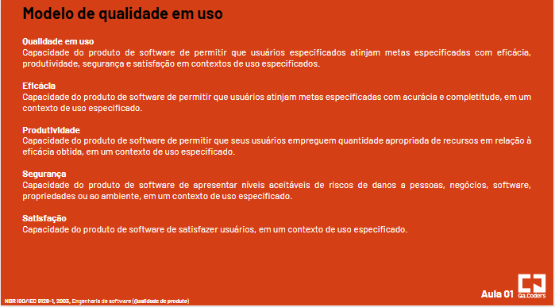

# O que é Qualidade?

Entendida como conjunto de caracteristicas a serem satisfeitas, atendendo a necessidade dos seus clientes.

Tem como objetivo criar atraves de processos prevenção de erros, tornando o desenvolvimento escalavel, com facil manutenção, boa performance, segurança, usabilidade, sem deixar de lado a cultura e aplicação de boas práticas, lembrando que Qualidade é uma cultura e não se aplica Qualidade se a cultura das pessoas não mudar primeiro. 

​Você pode ter os melhores processos, os melhores profissionais, as melhores tecnologias, mas se as pessoas não enxergarem o valor daquela ação, qualidade não se aplica.
Pois ninguém executa algo em que elas não acreditam.​

Por "William Alves da Silva".

# Como Aplicar?

Existem varias formas de aplicação da qualidade de software, o que sera abordado é sobre o Shift Left Right Testing, sobre a aplicação, é priorizada o início do processo, garantindo desde a concepção da demanda, até a entrega DevOps(pipeline), prevenindo os erros e não conformidades

Não se cria software sem erros, mas é sempre possível fazer entregas com a melhor qualidade possivel.

# Objetivo

De acordo com a norma NBR ISO/IEC 9126, qualidade do produto de software, tem por objetivo, validar o produto, considerando duas partes:

a) Qualidade Interna e Externa

b) Qualidade em uso (satisfação do usuário)

O que permite que a qualidade do produto seja *especificada e avaliada em diferentes perspectivas*, pelos envolvidos da aquisição, requisitos, desenvolvimento, uso, avaliação, apoio, manutenção e garantia de qualidade e auditoria de software.

Os modelos de qualidade de software são definidos para: 

- Validar a completidude de uma definição de requisitos;
- Indentificar requisitos de software;
- Identificar objetivos de projetos de software;
- Identificar objetivos para testes de software;
- Identificar critérios para garantia de software;
- Identificar critérios de aceitação para produtos finais de software;

Garantir que etapas importantes do processo de desenvolvimento de software sejam considerados e respeitados baseados em normas e criterios de aceite na construção do processo de software.

# Estrutura do modelo de qualidade

A qualidade do processo influencia os atributos de qualidade interna e influem nos atributos de qualidade externa, que acaba influenciando na qualidade de uso. Se o meu codigo for mal estrutura o usuário é impactado.

A qualidade precisa criar processos para que os requisitos sejam atendidos, a qualidade do produto pode ser avaliada medindo os atributos internos.

o Objetivo é que o produto tenha o efeito requerido num contexto de uso, significa que precisamos garantir que seja feito da melhor maneira possivel.

Qualiadde precisa estar aderente as necessidades da empresa, ao usuário, e as necessidades técnicas do time de desenvolvimento.

## Utilizando o modelo de qualidade

Recomandado que, para a avaliação de qualidade de um produto de sw, seja definido um modelo de qualidade, e que este modelo seja usado na definição de metas de qualidade p/ os produtos de sw final e intermediarios.

Não é possivel na prática, mediar todas as suas subcaracterísticas internas e externas p/ todas as partes de um produto de sw de grande porte. da mesma forma, não é prático medir a qualidade em uso para todos os cenários de testes. Necessário alocar recursos para avaliação entre os diferentes tipos de medições.

## Modelo de qualidade para qualidade interna e externa

Categorias de atributos de qualidade, em 6 características:

- Funcionalidade
- Confiabilidade
- Usabilidade
- Eficiência
- Manutenibilidade
- Portabilidade

Desenvolver software não é apenas escrever código, é pensar no processo como um todo.

**Funcionalidade**

Capacidade do produto de sw de prover funções que atendam as necessidades explicitas e implicitas, quando o sw estiver sendo utilizado sob condições específicas.

## Modelo de qualidade em uso

Define o modelo de qualidade para qualidade em uso, os atributos de qualidade em uso são categorizados em 4 características:

- Eficácia
- Produtividade
- Segurança
- Satisfação

Qualidade em uso é a **visão da qualidade sob a perspectiva do usuário**. Obtenção de qualidade em uso é **dependente da qualidade externa**, a qual por sua vez, é **dependente da obtenção da qualidade interna**.

## Métricas

Atributos internos e externos: Constata-se que os niveis de certos **atributos internos influenciam os níveis de atributos externos**, de modo que há tanto no aspecto **externo quanto um aspecto interno**, na maioria das características.

Confiabilidade, pode ser medida, **externamente, observando-se o número de falhas, num dado período de tempo de execução**, durante um experimento de uso do software e, internamente, **inspecionando as especificações detalhadas e o codigo-fonte**, para avaliação de tolerancia a falhas.